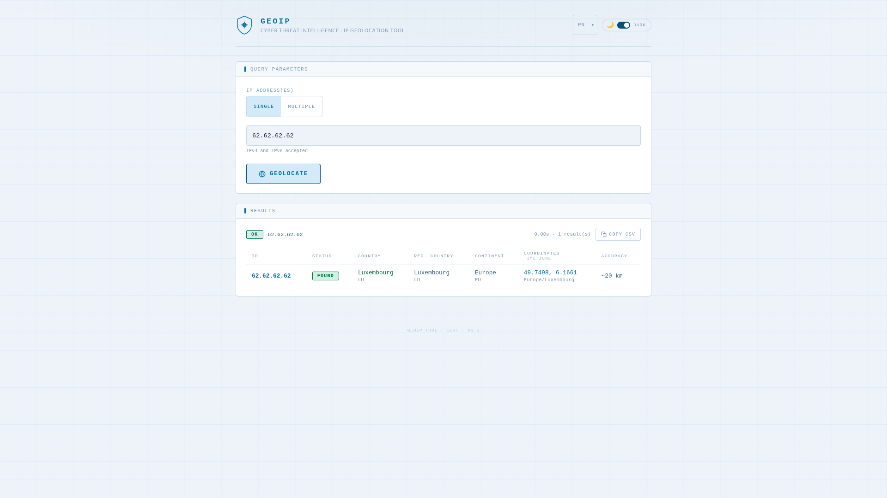

# http2geoip

> **GeoIP-over-HTTP** — A lightweight, stateless HTTP gateway that exposes IP geolocation as a JSON REST API.

Built in Go, it accepts a `POST` request with one or more IP addresses and returns structured geographic data sourced from a MaxMind GeoLite2 database. The binary embeds a static web UI and an OpenAPI specification, with zero runtime dependencies.

---

## Screenshot



> The embedded web UI (served at `/`) provides an interactive form to geolocate IP addresses and inspect responses directly in the browser. It supports **dark and light themes** and is fully translated into **15 languages**.

---

## Disclaimer

This project is released **as-is**, for demonstration or reference purposes.
It is **not maintained**: no bug fixes, dependency updates, or new features are planned. Issues and pull requests will not be addressed.

---

## License

This project is licensed under the **MIT License** — see the [`LICENSE`](LICENSE) file for details.

```
MIT License — Copyright (c) 2026 letstool
```

---

## Features

- Single static binary — no external runtime dependencies
- Embedded web UI and OpenAPI 3.1 specification (`/openapi.json`)
- Web UI available in **dark and light mode**, switchable at runtime via a toggle
- Web UI fully translated into **15 languages**: Arabic, Bengali, Chinese, German, English, Spanish, French, Hindi, Indonesian, Japanese, Korean, Portuguese, Russian, Urdu, Vietnamese
- Supports **single IP** and **batch IP** lookups in a single request
- Localized country and continent names in **7 languages**: `en`, `es`, `fr`, `ja`, `pt-BR`, `ru`, `zh-CN`
- Returns continent, country, registered country, coordinates, accuracy radius, and time zone
- Daily automatic database update from MaxMind or a peer instance
- Peer mode: sync the mmdb file from another running `http2geoip` instance via `/getdb`
- Configurable listen address, database path, update schedule, and IP batch limit
- Docker image built on `scratch` — minimal attack surface

---

## Prerequisites

- [Go](https://go.dev/dl/) **1.24+**
- A **MaxMind GeoLite2-City** database, obtained via:
  - A free MaxMind account and a download URL of the form:
    ```
    https://<user>:<license_key>@download.maxmind.com/geoip/databases/GeoLite2-City/download?suffix=tar.gz
    ```
  - Or another running `http2geoip` instance (peer mode).

---

## Build

### Native binary (Linux)

```bash
bash scripts/linux_build.sh
```

The binary is output to `./out/http2geoip`.

The script produces a **fully static binary** (no libc dependency):

```bash
go build \
    -trimpath \
    -ldflags="-extldflags -static -s -w" \
    -o ./out/http2geoip ./cmd/http2geoip
```

### Windows

```cmd
scripts\windows_build.cmd
```

### Docker image

```bash
bash scripts/docker_build.sh
```

This runs a two-stage Docker build:

1. **Builder** — `golang:1.24-alpine` compiles a static binary
2. **Runtime** — `scratch` image, containing only the binary

The resulting image is tagged `letstool/http2geoip:latest`.

---

## Run

### Native (Linux)

```bash
bash scripts/linux_run.sh
```

Edit the script to set your MaxMind download URL before running.

### Windows

```cmd
scripts\windows_run.cmd
```

### Docker

```bash
bash scripts/docker_run.sh
```

Equivalent to:

```bash
docker run -it --rm \
  -p 8080:8080 \
  -v ./db:/data:rw \
  -e GEOIP_DB_URL="https://<user>:<key>@download.maxmind.com/geoip/databases/GeoLite2-City/download?suffix=tar.gz" \
  -e GEOIP_LISTEN_ADDR=0.0.0.0:8080 \
  letstool/http2geoip:latest
```

Once running, the service is available at [http://localhost:8080](http://localhost:8080).

---

## Configuration

Each setting can be provided as a CLI flag or an environment variable. The CLI flag always takes priority. Resolution order: **CLI flag → environment variable → default**.

| CLI flag         | Environment variable  | Default             | Description                                                                                    |
|------------------|-----------------------|---------------------|------------------------------------------------------------------------------------------------|
| `-listen`        | `GEOIP_LISTEN_ADDR`   | `127.0.0.1:8080`    | Address and port the HTTP server listens on.                                                   |
| `-db-url`        | `GEOIP_DB_URL`        | *(none)*            | MaxMind download URL (tar.gz) or base URL of a peer `http2geoip` instance.                    |
| `-db-dir`        | `GEOIP_DB_DIR`        | `/data`             | Directory used to store and cache the mmdb file.                                               |
| `-update-hour`   | `GEOIP_UPDATE_HOUR`   | `02:00`             | Daily database refresh time, in `HH:MM` UTC format.                                           |
| `-max-ips`       | `GEOIP_MAX_IPS`       | `100`               | Maximum number of IP addresses accepted in a single batch request.                             |

**Examples:**

```bash
# Using CLI flags
./out/http2geoip -listen 0.0.0.0:9090 -db-url https://<user>:<key>@download.maxmind.com/... -max-ips 500

# Using environment variables
GEOIP_LISTEN_ADDR=0.0.0.0:9090 GEOIP_MAX_IPS=500 ./out/http2geoip

# Peer mode: sync the database from another instance
./out/http2geoip -db-url http://internal-geoip-host:8080
```

---

## Database management

On startup, the server checks whether a cached mmdb file exists in `GEOIP_DB_DIR` and whether it was last downloaded today. If not, it fetches a fresh copy from `GEOIP_DB_URL`.

**MaxMind mode** — when the URL points to `download.maxmind.com`, the server downloads the official GeoLite2-City tar.gz archive and extracts the mmdb file directly.

**Peer mode** — when the URL points to any other host, the server fetches the mmdb from the `/getdb` endpoint of that host (another `http2geoip` instance). If the download fails, it retries silently every 5 minutes.

The database is then refreshed daily at the time configured by `-update-hour` / `GEOIP_UPDATE_HOUR`, without any server restart.

---

## API Reference

### `POST /api/v1/geoip`

Geolocates one or more IP addresses and returns structured geographic data.

Exactly one of `ip` (single lookup) or `ips` (batch lookup) must be provided per request.

#### Request body

```json
{
  "ip": "8.8.8.8",
  "lang": "en"
}
```

```json
{
  "ips": ["8.8.8.8", "1.1.1.1", "2606:4700:4700::1111"],
  "lang": "fr"
}
```

| Field  | Type       | Required          | Description                                                                               |
|--------|------------|-------------------|-------------------------------------------------------------------------------------------|
| `ip`   | `string`   | One of `ip`/`ips` | Single IPv4 or IPv6 address to look up.                                                   |
| `ips`  | `string[]` | One of `ip`/`ips` | Batch of IPv4/IPv6 addresses. Maximum count controlled by `-max-ips` / `GEOIP_MAX_IPS`.  |
| `lang` | `string`   | No                | Language for localized names. One of: `en`, `es`, `fr`, `ja`, `pt-BR`, `ru`, `zh-CN`. Defaults to `en`. |

#### Response body

```json
{
  "status": "SUCCESS",
  "answers": [
    {
      "ip": "8.8.8.8",
      "continent_code": "NA",
      "continent_name": "North America",
      "country_isocode": "US",
      "country_name": "United States",
      "accuracy": 1000,
      "latitude": 37.751,
      "longitude": -97.822,
      "time_zone": "America/Chicago",
      "reg_country_name": "United States",
      "reg_country_code": "US"
    }
  ]
}
```

| Field     | Type         | Description                                                     |
|-----------|--------------|-----------------------------------------------------------------|
| `status`  | `string`     | `SUCCESS`, `NOTFOUND`, or `ERROR`                               |
| `answers` | `Answer[]`   | List of geolocation records. Empty when status is not `SUCCESS`. |

Each `Answer` object:

| Field              | Type              | Description                                              |
|--------------------|-------------------|----------------------------------------------------------|
| `ip`               | `string`          | The queried IP address                                   |
| `continent_code`   | `string \| null`  | Two-letter continent code (e.g. `EU`)                    |
| `continent_name`   | `string \| null`  | Localized continent name                                 |
| `country_isocode`  | `string \| null`  | ISO 3166-1 alpha-2 country code (e.g. `FR`)              |
| `country_name`     | `string \| null`  | Localized country name                                   |
| `accuracy`         | `integer \| null` | Accuracy radius in kilometers                            |
| `latitude`         | `number \| null`  | Geographic latitude                                      |
| `longitude`        | `number \| null`  | Geographic longitude                                     |
| `time_zone`        | `string \| null`  | IANA time zone identifier (e.g. `Europe/Paris`)          |
| `reg_country_name` | `string \| null`  | Localized name of the registered country                 |
| `reg_country_code` | `string \| null`  | ISO 3166-1 alpha-2 code of the registered country        |

#### Status codes

| Value      | Meaning                                                         |
|------------|-----------------------------------------------------------------|
| `SUCCESS`  | Lookup succeeded, `answers` is populated                        |
| `NOTFOUND` | No geographic data found for the given IP(s)                    |
| `ERROR`    | Request malformed, IP invalid, or database not yet initialized  |

#### Example — single IP lookup

```bash
curl -s -X POST http://localhost:8080/api/v1/geoip \
  -H "Content-Type: application/json" \
  -d '{"ip":"8.8.8.8","lang":"en"}' | jq .
```

```json
{
  "status": "SUCCESS",
  "answers": [
    {
      "ip": "8.8.8.8",
      "continent_code": "NA",
      "continent_name": "North America",
      "country_isocode": "US",
      "country_name": "United States",
      "accuracy": 1000,
      "latitude": 37.751,
      "longitude": -97.822,
      "time_zone": "America/Chicago",
      "reg_country_name": "United States",
      "reg_country_code": "US"
    }
  ]
}
```

#### Example — batch lookup

```bash
curl -s -X POST http://localhost:8080/api/v1/geoip \
  -H "Content-Type: application/json" \
  -d '{"ips":["8.8.8.8","1.1.1.1"],"lang":"fr"}' | jq .
```

### `GET /`

Returns the embedded interactive web UI.

### `GET /openapi.json`

Returns the full OpenAPI 3.1 specification of the API.

### `GET /favicon.png`

Returns the application icon.

### `GET /getdb`

Serves the current GeoLite2-City mmdb file. Used by peer instances to sync their database without a MaxMind account.

---

## Development

Dependencies are managed with Go modules. After cloning:

```bash
go mod download
go build ./...
```

The test suite and initialization scripts are located in `scripts/`:

```
scripts/000_init.sh     # Environment setup
scripts/999_test.sh     # Integration tests
```

---

## AI-Assisted Development

This project was developed with the assistance of **[Claude Sonnet 4.6](https://www.anthropic.com/claude)** by Anthropic.
